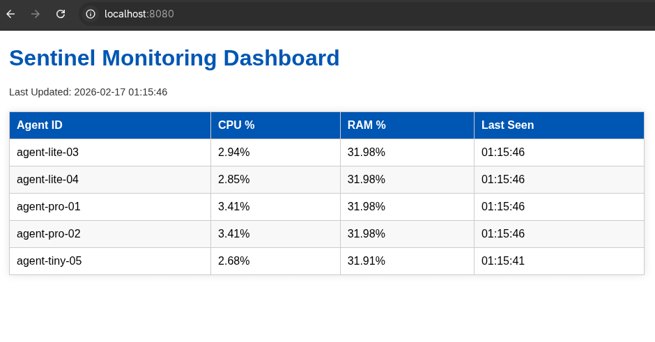
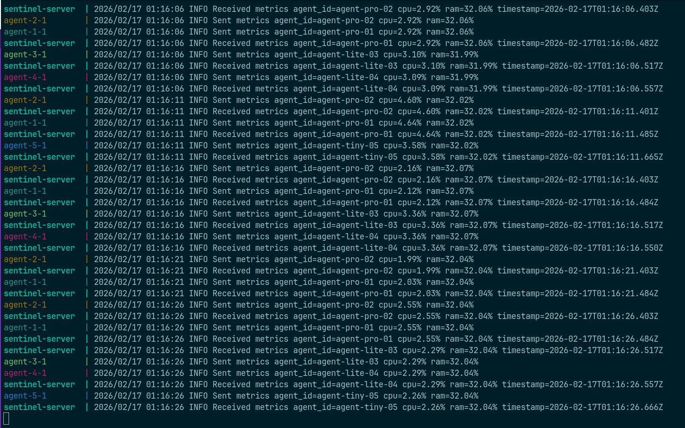

# Sentinel: Distributed System Monitor (`sentinel`)

[](https://golang.org)
[](LICENSE)

Sentinel is a high-performance distributed system monitor built in Go. It provides real-time monitoring of CPU and RAM usage across multiple remote computers using gRPC for efficient client-side streaming.

Designed for scalability and low latency, Sentinel leverages Go's concurrency and gRPC's streaming capabilities to gather and visualize metrics from a distributed fleet of agents in a centralized dashboard.

### Visual Showcase
#### Sentinel Monitoring Dashboard


_A clean web-based dashboard displaying real-time metrics from connected agents._

#### Server Console Output


_The server console showing received metrics from multiple agents._

### Technical Highlights
- **gRPC Client-side Streaming**: Implemented efficient metric reporting using gRPC client-side streaming, allowing agents to maintain a persistent connection and push updates with minimal overhead.
- **Concurrency via Goroutines**: Leveraged Go's lightweight goroutines to handle multiple concurrent gRPC streams and the HTTP dashboard server simultaneously without blocking.
- **Configuration Hierarchy**: Implemented a multi-layered configuration system using Viper and Cobra, supporting a precedence order of: CLI Flags > Environment Variables > Config Files > Defaults.
- **Modular Architecture**: Separated metric collection, gRPC communication, and dashboard rendering into decoupled internal packages, ensuring high testability and maintainability.

### Key Features
- **Real-time Monitoring**: Instant visibility into CPU and RAM usage across all connected agents.
- **Distributed Architecture**: Centralized server architecture designed to gather reports from multiple remote nodes.
- **Web-based Dashboard**: Clean and intuitive HTML dashboard to visualize the health of your entire system.
- **Single Binary Convenience**: Both server and agent functionalities are packed into a single, easy-to-deploy executable.
- **Flexible Configuration**: Manage settings via command-line flags, environment variables, or YAML config files.
- **Automated Demo**: Easy-to-run Docker Compose setup for instant demonstration and testing.

### Getting Started

#### Prerequisites
- Go (1.25 or later recommended)
- Docker and Docker Compose (for the demo)
- Make (for building and testing)

#### Installation
Clone the repository and build the binary:

```bash
git clone https://github.com/nradojcic/sentinel.git
cd sentinel
make build
```
The executable will be available in the local `bin/` directory. You can add it to your PATH:
```bash
cp bin/sentinel /usr/local/bin/
```

### Usage
Sentinel provides a clean CLI interface powered by Cobra. It can be run as either a **server** or an **agent**.

#### 1. Running the Docker Demo
You can quickly test Sentinel with a pre-configured 1-server, 5-agent distributed system:

1.  **Run the demo** with a single command from the project's root directory:
    ```bash
    docker-compose up --build
    ```
2.  **View the dashboard**: Once the containers are running, open your web browser and go to:
    [http://localhost:8080](http://localhost:8080)
3.  **Stop the demo**: To stop and remove all the containers and the network, run:
    ```bash
    docker-compose down
    ```

#### 2. Manual Execution

**Start the Server:**
```bash
sentinel server --port 50051 --http-port 8080
```

**Start an Agent:**
```bash
sentinel agent --agent-id "node-01" --server-addr "localhost:50051" --interval 5
```

#### Command-Specific Flags
`server` command flags:
- `--port string`: Server gRPC port (default "50051").
- `--http-port string`: Dashboard HTTP port (default "8080").

`agent` command flags:
- `--agent-id string`: Unique ID for the agent (default "default-agent").
- `--server-addr string`: Address of the Sentinel server (default "localhost:50051").
- `--interval int`: Report interval in seconds (default 5).

Global flag:
- `-c, --config string`: Path to config file (default is `$HOME/.sentinel.yaml`).

### Configuration
Sentinel uses Viper for flexible configuration. It looks for a `.sentinel.yaml` file in the current directory or your home folder.

Example `.sentinel.yaml`:
```yaml
server:
  port: "50051"
  http-port: "8080"
agent:
  server-addr: "localhost:50051"
  agent-id: "my-agent"
  interval: 5
```

### Tech Stack
- **Go**: The core language, chosen for its performance and concurrency model.
- **gRPC & Protobuf**: For efficient, type-safe communication between agents and server.
- **Cobra & Viper**: For modern CLI interface and configuration management.
- **gopsutil**: To gather system metrics (CPU, RAM) across different platforms.
- **HTML Templates**: For rendering the real-time web dashboard.

### Development
Run the test suite with the race detector enabled:
```bash
make test
```

### Test Results
Sentinel maintains a high standard of code quality with comprehensive testing across all core packages.

**Test Summary:**
- **collector**: 75.0% coverage
- **dashboard**: 88.0% coverage
- **store**: 100.0% coverage

To create the visual line-by-line coverage report:
```bash
make coverage
```
- The report will be generated as `coverage.out` and `coverage.html` in the project root.
- The full HTML report is included in this repository for easy viewing at the link below:
- [View Coverage Report](assets/coverage.html)

### License
This project is licensed under the MIT License - see the [LICENSE](LICENSE) file for details.
